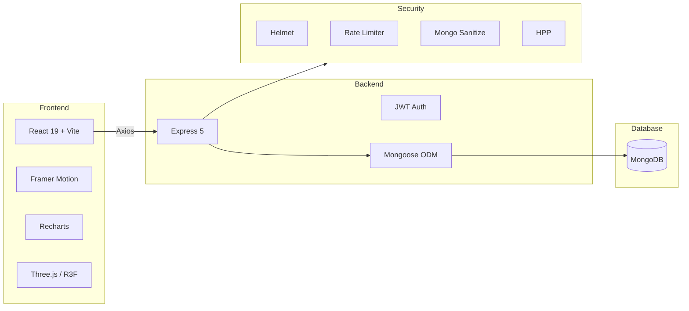

<div align="center">

# 🏦 SecureBank

### Enterprise-Grade Banking Application

**A production-ready, full-stack banking platform built with the MERN stack, featuring ACID-compliant transfers, Two-Factor Authentication, real-time analytics, and comprehensive security hardening.**

[](https://github.com/talhamajid/secure-banking-lab/actions)
[](LICENSE)
[](https://nodejs.org/)
[](https://react.dev/)
[](https://www.mongodb.com/)
[](https://playwright.dev/)

</div>

---

> ### 🌐 Live Demo
> 
> | Service | URL |
> |---------|-----|
> | 🖥️ **Frontend** | `https://securebank.vercel.app` |
> | ⚡ **Backend API** | `https://securebank-api.railway.app` |
> | 📬 **Postman Collection** | [Download & Import →](postman/SecureBank.postman_collection.json) |
>
> **Demo Credentials:** `demo@securebank.com` / `DemoPass123!`

---

## ✨ Features

<table>
<tr>
<td width="50%">

### 🔐 Security
- JWT + httpOnly Cookie Authentication
- Two-Factor Authentication (TOTP)
- Transfer PIN with bcrypt hashing
- NoSQL Injection prevention
- XSS sanitization
- Rate limiting on sensitive endpoints
- CORS + Helmet + HPP middleware

</td>
<td width="50%">

### 💸 Banking
- ACID-compliant money transfers
- Atomic balance deductions (no double-spend)
- Idempotent transactions (database-level)
- SHA-256 receipt integrity hashing
- Virtual card generation (Visa/Mastercard)
- Real-time transaction history

</td>
</tr>
<tr>
<td width="50%">

### 📊 Dashboard
- Interactive balance trend charts
- Monthly cash flow analysis
- Spending breakdown (pie chart)
- Security health score
- Quick action widgets
- Dark / Light theme

</td>
<td width="50%">

### 🛡️ Admin Panel
- User management
- Transaction monitoring
- Virtual card oversight
- Audit log viewer
- Real-time platform statistics

</td>
</tr>
</table>

---

## 🏗️ Architecture



---

## 🗃️ Project Structure

```
SecureBank/
├── client/                    # React frontend (Vite)
│   ├── src/
│   │   ├── api/               # Axios instance & interceptors
│   │   ├── components/        # Reusable UI components
│   │   ├── context/           # React Context providers
│   │   ├── pages/             # Route-level pages
│   │   └── utils/             # Event dispatcher, helpers
│   ├── Dockerfile             # Multi-stage build (Nginx)
│   └── nginx.conf             # Production Nginx config
│
├── server/                    # Node.js backend (Express)
│   ├── controllers/           # Route handlers
│   ├── middleware/            # Auth, rate limiting, observability
│   ├── models/                # Mongoose schemas
│   ├── routes/                # Express routers
│   ├── services/              # Refund service
│   ├── utils/                 # Logger utility
│   └── Dockerfile             # Production Node.js image
│
├── tests/
│   ├── e2e/                   # Playwright E2E tests
│   │   ├── auth.spec.js
│   │   ├── transfer.spec.js
│   │   └── security.spec.js
│   └── artillery/             # Load testing
│       ├── load-test.yml
│       └── smoke-test.yml
│
├── docs/                      # Enterprise documentation
│   ├── architecture.md
│   ├── api.md
│   ├── database.md
│   ├── security.md
│   ├── deployment.md
│   ├── testing.md
│   ├── decisions.md           # ADRs
│   └── roadmap.md
│
├── .github/workflows/ci.yml   # GitHub Actions CI/CD
├── docker-compose.yml         # One-command development setup
├── playwright.config.js       # E2E test configuration
├── lighthouserc.js            # Performance budgets
├── CHANGELOG.md
├── CONTRIBUTING.md
└── LICENSE
```

---

## 🚀 Quick Start

### Docker (Recommended)

```bash
git clone https://github.com/talhamajid/secure-banking-lab.git
cd secure-banking-lab
docker compose up -d
```

| Service        | URL                         |
|---------------|----------------------------|
| Frontend      | http://localhost:80         |
| Backend API   | http://localhost:5000       |
| Mongo Express | http://localhost:8081       |

### Manual Setup

```bash
# Backend
cd server
npm install
cp .env.example .env    # Configure your MongoDB URI
npm run dev

# Frontend (new terminal)
cd client
npm install
npm run dev
```

---

## 🧪 Testing

```bash
# Install Playwright browsers
npx playwright install chromium

# E2E Tests (4 viewports: Desktop, Laptop, Tablet, Mobile)
npm run test:e2e

# Security Tests (2FA bypass, NoSQL injection, JWT attacks)
npm run test:security

# Load Testing
npm run test:load
npm run test:load:stress

# Lighthouse Performance Audit
npm run test:lighthouse
```

### Test Coverage Matrix

| Feature         | E2E | Visual | A11y | Security | Load |
|----------------|-----|--------|------|----------|------|
| Login          | ✅  | ✅     | ✅   | ✅       | ✅   |
| Register       | ✅  | ✅     | ✅   | —        | —    |
| 2FA            | ✅  | —      | —    | ✅       | —    |
| Transfer       | ✅  | —      | —    | ✅       | ✅   |
| Dashboard      | ✅  | ✅     | —    | —        | ✅   |
| Admin          | ✅  | —      | —    | ✅       | —    |

---

## 🛡️ Security Highlights

| Vulnerability           | Mitigation                                        |
|------------------------|---------------------------------------------------|
| NoSQL Injection        | `express-mongo-sanitize` on all request properties |
| 2FA Bypass             | Signed `tempToken` JWT (5min TTL)                 |
| Double-Spend           | MongoDB atomic `findOneAndUpdate` + `$gte` guard  |
| Replay Attack          | Unique `requestId` index in database              |
| DOM XSS               | Replaced dangerous `document.write()` with native CSS `@media print` layouts |
| Cookie Theft           | `httpOnly` + `secure` + `sameSite: strict`        |

---

## 📖 Documentation

| Document | Description |
|----------|-------------|
| [Architecture](docs/architecture.md) | System design, request lifecycle, data flow |
| [API Reference](docs/api.md) | All endpoints with request/response examples |
| [Database Schema](docs/database.md) | ER diagram and indexing strategy |
| [Security](docs/security.md) | Threat model and mitigation details |
| [Deployment](docs/deployment.md) | Docker, cloud deployment, and rollback strategy |
| [Testing](docs/testing.md) | Test coverage matrix and performance budgets |
| [Decisions](docs/decisions.md) | Architecture Decision Records (ADRs) |
| [Roadmap](docs/roadmap.md) | Version history and future plans |

---

## 🛠️ Tech Stack

| Layer      | Technology                                    |
|-----------|-----------------------------------------------|
| Frontend  | React 19, Vite, Framer Motion, Three.js, Recharts |
| Backend   | Node.js, Express 5, Mongoose, JWT             |
| Database  | MongoDB 7 (Atlas / Docker)                    |
| Security  | Helmet, HPP, express-mongo-sanitize, bcrypt   |
| Testing   | Playwright, axe-core, Artillery, Lighthouse CI |
| DevOps    | Docker, Docker Compose, GitHub Actions         |

---

## 📬 API Collection

A complete Postman collection is included for quick API testing:

```
postman/SecureBank.postman_collection.json
```

**Includes:**
- ✅ All 30+ endpoints organized by feature (Auth, Transactions, Cards, Admin, Security)
- ✅ Pre-filled request bodies with example data
- ✅ Auto-generated `{{$guid}}` for idempotent transfer requests
- ✅ 🔴 **Security Test folder** – Negative test cases (NoSQL injection, 2FA bypass, invalid JWT) that should all fail

**How to use:**
1. Import the JSON file into [Postman](https://www.postman.com/) or [Bruno](https://www.usebruno.com/)
2. Set the `{{baseUrl}}` variable (default: `http://localhost:5000`)
3. Run "Register" or "Login" first – cookies are automatically managed
4. All protected endpoints will work after login

---

## 📄 License

**Copyright (c) 2026 Talha Majid. All Rights Reserved.**

This repository is public for portfolio and demonstration purposes only. You are not granted any rights to copy, modify, distribute, or use this code for any commercial or non-commercial purpose without explicit written permission. See the [LICENSE](LICENSE) file for details.

---

<div align="center">

**Built with ❤️ by [Talha Majid](https://github.com/talhamajid)**

⭐ Star this repo if you find it valuable!

</div>
