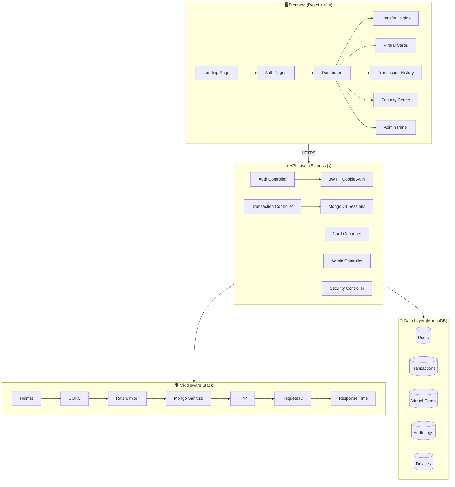
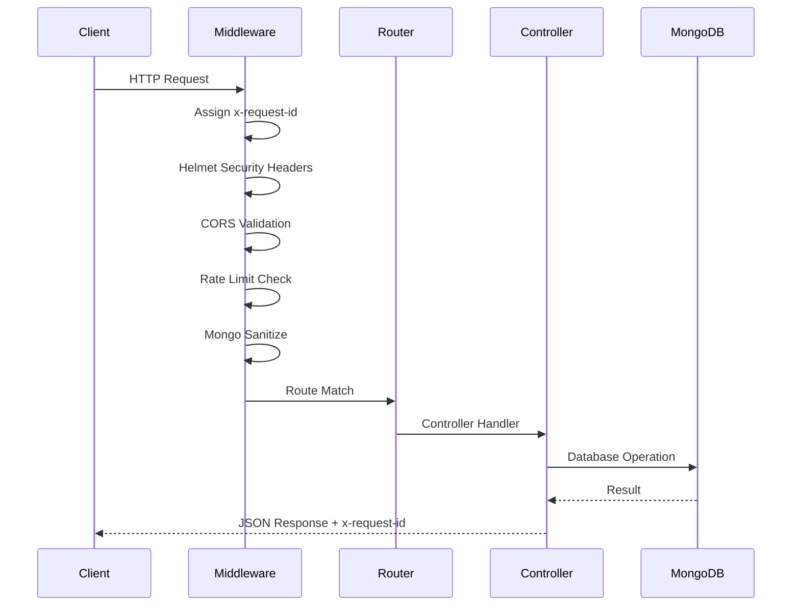
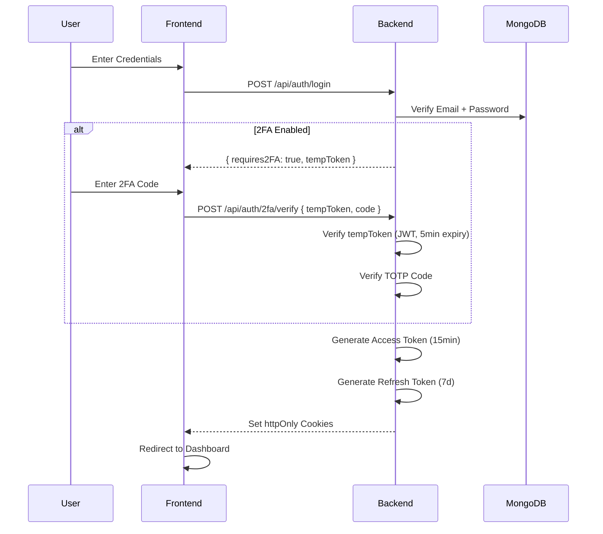
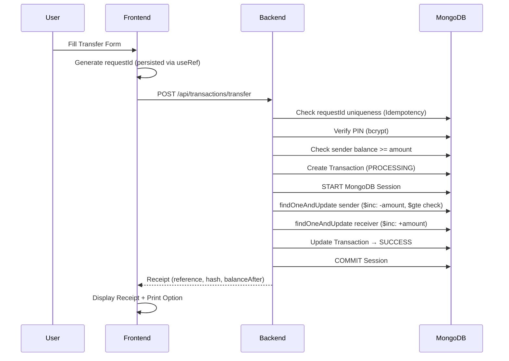

# SecureBank – System Architecture

## High-Level Architecture

```mermaid
graph TB
    subgraph Client["🖥️ Frontend (React + Vite)"]
        A[Landing Page] --> B[Auth Pages]
        B --> C[Dashboard]
        C --> D[Transfer Engine]
        C --> E[Virtual Cards]
        C --> F[Transaction History]
        C --> G[Security Center]
        C --> H[Admin Panel]
    end

    subgraph API["⚡ API Layer (Express.js)"]
        I[Auth Controller] --> J[JWT + Cookie Auth]
        K[Transaction Controller] --> L[MongoDB Sessions]
        M[Card Controller]
        N[Admin Controller]
        O[Security Controller]
    end

    subgraph Middleware["🛡️ Middleware Stack"]
        P[Helmet] --> Q[CORS]
        Q --> R[Rate Limiter]
        R --> S[Mongo Sanitize]
        S --> T[HPP]
        T --> U[Request ID]
        U --> V[Response Time]
    end

    subgraph Data["💾 Data Layer (MongoDB)"]
        W[(Users)]
        X[(Transactions)]
        Y[(Virtual Cards)]
        Z[(Audit Logs)]
        AA[(Devices)]
    end

    Client -->|HTTPS| API
    API --> Middleware
    API --> Data
```

## Request Lifecycle

```mermaid
sequenceDiagram
    participant C as Client
    participant M as Middleware
    participant R as Router
    participant CT as Controller
    participant DB as MongoDB

    C->>M: HTTP Request
    M->>M: Assign x-request-id
    M->>M: Helmet Security Headers
    M->>M: CORS Validation
    M->>M: Rate Limit Check
    M->>M: Mongo Sanitize
    M->>R: Route Match
    R->>CT: Controller Handler
    CT->>DB: Database Operation
    DB-->>CT: Result
    CT-->>C: JSON Response + x-request-id
```

## Authentication Flow

```mermaid
sequenceDiagram
    participant U as User
    participant FE as Frontend
    participant BE as Backend
    participant DB as MongoDB

    U->>FE: Enter Credentials
    FE->>BE: POST /api/auth/login
    BE->>DB: Verify Email + Password
    
    alt 2FA Enabled
        BE-->>FE: { requires2FA: true, tempToken }
        U->>FE: Enter 2FA Code
        FE->>BE: POST /api/auth/2fa/verify { tempToken, code }
        BE->>BE: Verify tempToken (JWT, 5min expiry)
        BE->>BE: Verify TOTP Code
    end

    BE->>BE: Generate Access Token (15min)
    BE->>BE: Generate Refresh Token (7d)
    BE-->>FE: Set httpOnly Cookies
    FE->>FE: Redirect to Dashboard
```

## Transfer Flow (ACID Compliant)

```mermaid
sequenceDiagram
    participant U as User
    participant FE as Frontend
    participant BE as Backend
    participant DB as MongoDB

    U->>FE: Fill Transfer Form
    FE->>FE: Generate requestId (persisted via useRef)
    FE->>BE: POST /api/transactions/transfer
    
    BE->>DB: Check requestId uniqueness (Idempotency)
    BE->>DB: Verify PIN (bcrypt)
    BE->>DB: Check sender balance >= amount
    
    BE->>DB: Create Transaction (PROCESSING)
    BE->>DB: START MongoDB Session
    BE->>DB: findOneAndUpdate sender ($inc: -amount, $gte check)
    BE->>DB: findOneAndUpdate receiver ($inc: +amount)
    BE->>DB: Update Transaction → SUCCESS
    BE->>DB: COMMIT Session
    
    BE-->>FE: Receipt (reference, hash, balanceAfter)
    FE->>FE: Display Receipt + Print Option
```
