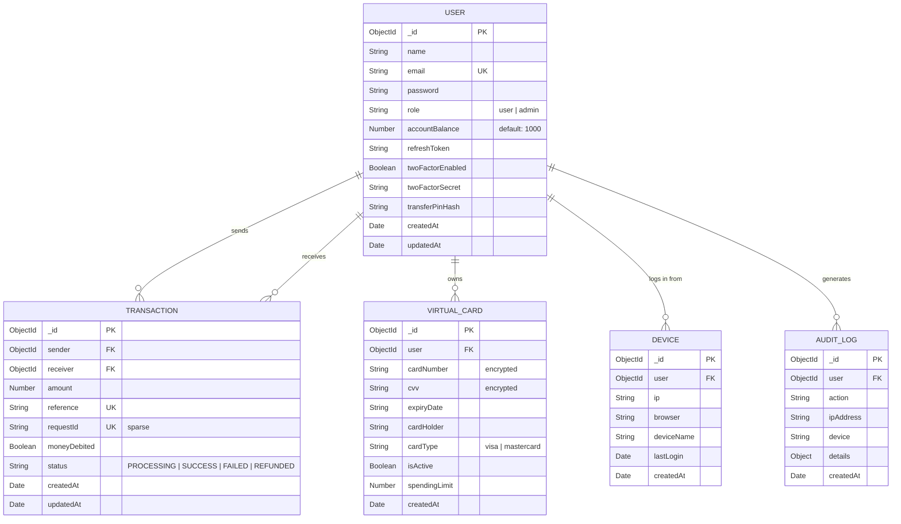

# SecureBank – Database Schema

## Entity Relationship Diagram

## Indexing Strategy

| Collection    | Field(s)              | Type   | Purpose                                  |
|---------------|----------------------|--------|------------------------------------------|
| Users         | `email`              | Unique | Fast user lookup during login            |
| Transactions  | `sender`, `receiver` | Index  | Transaction history queries              |
| Transactions  | `reference`          | Unique | Unique transfer references               |
| Transactions  | `requestId`          | Unique (sparse) | Idempotency enforcement       |
| Transactions  | `createdAt`          | Index  | Sorted transaction history               |
| Transactions  | `status`             | Index  | Refund service queries                   |
| AuditLogs     | `user`, `createdAt`  | Compound | Audit trail queries                    |
| Devices       | `user`, `ip`         | Compound | Device deduplication                   |
